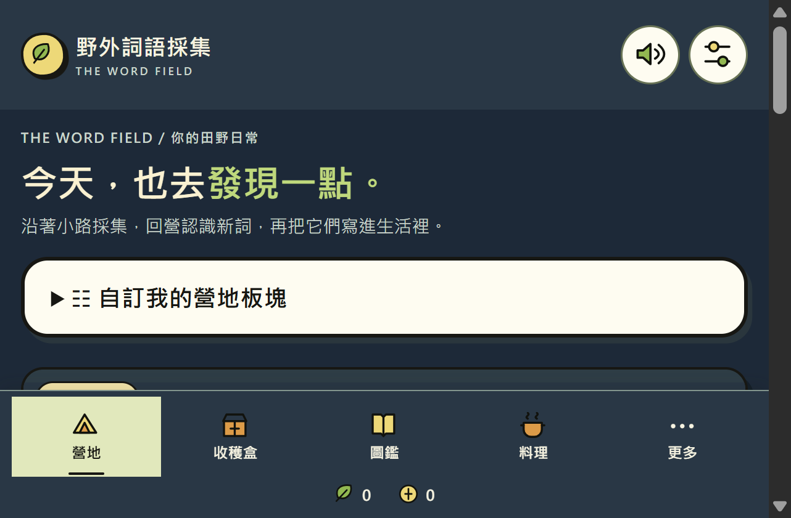

# 野外词语采集 v0.42.0

**[下载 Windows x64 便携版](https://github.com/picapica2025/word-field-downloads/releases/download/v0.42.0/WordField-Windows-x64-v0.42.0.zip)** · [Release 页面](https://github.com/picapica2025/word-field-downloads/releases/tag/v0.42.0)

这是一个本机运行的森林营地英语学习游戏。当前发布的是未签名的 Windows x64 预览包，解压后运行 `app/WordField.exe`，需要 Microsoft Edge WebView2 Evergreen Runtime，不需要 Node.js 或本地服务器。

## 内容与存档

- 单一 IELTS 备考词书：6,550 个词条、12,840 条例句记录；不是官方 IELTS 词表。
- 所有词条仍待独立人工语言审校。
- 桌面存档位于 `%LOCALAPPDATA%\WordField\WebView2`，与浏览器版分开。可通过设置页的 JSON 导入／导出迁移。
- 完整启动说明见压缩包内 `START_HERE.md`。

## 验收状态

- 自动测试 249 项通过，语法检查通过。
- 隔离 WebView2 启动检查通过，刷新后本机存档可读。
- 未签名、非安装程序，尚未在多种实体 Windows 设备上验证，也未提交 Microsoft Store。

## 来源与许可

ZIP 包含 ECDICT、Tatoeba、OpenCC 衍生检索资料的来源声明和许可文件，请保留包内相关说明。项目自身代码和原创素材尚未声明公开许可；本下载不授予再分发、修改或商业使用权。词库来源、署名与使用边界见 ZIP 内 `app/wwwroot/THIRD_PARTY_NOTICES.md`。

完整版本说明见 [RELEASE_NOTES_v0.42.0.md](RELEASE_NOTES_v0.42.0.md)，文件校验值见 [SHA256SUMS.txt](SHA256SUMS.txt)。

